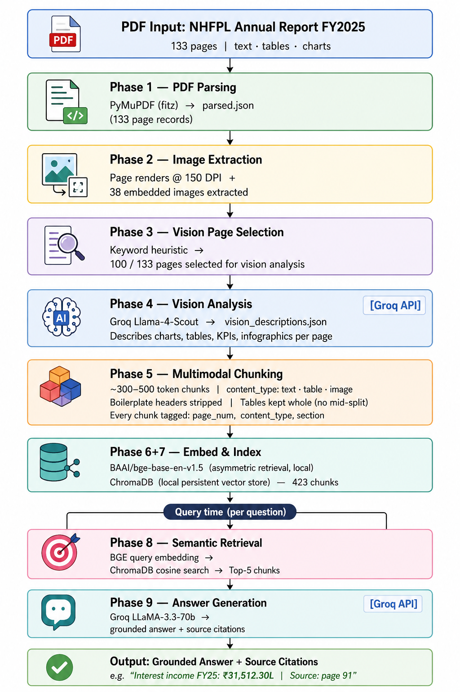

# Multimodal RAG — Niwas Housing Finance FY2025 Annual Report

A complete Retrieval-Augmented Generation (RAG) pipeline over the Niwas Housing Finance FY2025 Annual Report (133 pages). The pipeline extracts **free text**, **financial tables**, and **embedded charts/figures**, indexes them in a local vector database, and answers natural-language questions with grounded, cited responses.

---

## Architecture



---

## Library Choices & Justification

| Component | Library | Why |
|-----------|---------|-----|
| PDF Parsing | **PyMuPDF (fitz)** | Fast, reliable block-level text extraction. Handles dense financial tables and mixed layouts better than pdfplumber. Falls back to `get_text("blocks")` when markdown extraction fails. |
| Vision / Charts | **Groq Llama-4-Scout** | Free multimodal API, handles financial bar charts and infographics accurately. Describes axis values, numeric KPIs, and table contents in structured text. |
| Embeddings | **BAAI/bge-base-en-v1.5** | Asymmetric retrieval model — query prefix applied for better recall. Outperforms symmetric models on financial document QA. Runs locally, no API cost. |
| Vector DB | **ChromaDB** | Local, zero-config, persistent store. No Docker or server setup required. |
| LLM for Answers | **Groq LLaMA-3.3-70b** | Fast inference, strong instruction following, free tier. Produces concise, cited answers without hallucination on financial text. |

---

## Project Structure

```
multimodal_rag/
├── config.py                  # Single source of truth for all config
├── demo.py                    # CLI demo — answers all 6 test questions
├── requirements.txt
├── .env.example               # API key template (no secrets committed)
├── notebooks/
│   └── rag_demo.ipynb         # Jupyter notebook demo (D-03)
├── src/
│   ├── parser.py              # Phase 1 — PDF parsing
│   ├── image_extractor.py     # Phase 2 — image extraction
│   ├── vision_selector.py     # Phase 3 — vision page selection
│   ├── vision_analyzer.py     # Phase 4 — Groq vision analysis
│   ├── chunker.py             # Phase 5 — multimodal chunking
│   ├── embedder.py            # Phase 6+7 — embedding + ChromaDB indexing
│   ├── retriever.py           # Phase 8 — semantic retrieval
│   ├── rag_engine.py          # Phase 9 — RAG answer generation
│   ├── pipeline.py            # Full pipeline orchestrator
│   └── utils.py               # Logging, JSON helpers, timer
├── data/
│   ├── raw/                   # PDF goes here
│   ├── parsed/                # parsed.json, pages_md/
│   ├── images/                # page renders, embedded images, vision JSONs
│   ├── chunks/                # chunks.json
│   └── vectordb/              # ChromaDB persistent store
└── outputs/                   # Demo results JSON
```

---

## Setup (under 5 minutes)

### Prerequisites

- Python 3.10+
- [Groq API key](https://console.groq.com) — free tier, used for vision analysis and answer generation
- ~4 GB disk space for embeddings and page renders

### 1. Clone and install

```bash
git clone <your-repo-url>
cd multimodal_rag
python -m venv .venv
source .venv/bin/activate        # Windows: .venv\Scripts\activate
pip install -r requirements.txt
```

### 2. Set environment variables

```bash
cp .env.example .env
# Open .env and set your Groq API key:
# GROQ_API_KEY=your_key_here
```

### 3. Place the PDF

```bash
# Copy the annual report PDF to:
data/raw/NHFPL_Annual_Report _FY2025.pdf
```

### 4. Run the full pipeline

```bash
python src/pipeline.py
```

This runs all 9 phases sequentially. Phases 1–7 only need to run once — results are cached to disk.

**Expected runtime:**

| Phase | Time |
|-------|------|
| Phase 1–3 (parse, extract, select) | ~1 min |
| Phase 4 (vision, 100 pages, Groq rate limited) | ~15–20 min |
| Phase 5–7 (chunk, embed, index) | ~3 min |
| **Total** | **~25 min** |

### 5. Run the demo

```bash
# CLI — all 6 test questions (recommended)
python demo.py

# Single question
python demo.py --question 3

# Jupyter notebook
jupyter notebook notebooks/rag_demo.ipynb
```

---

## Required Test Questions & Results

| # | Type | Question | Source Hint | Status |
|---|------|----------|-------------|--------|
| 1 | TEXT | Key risks highlighted in the MD&A section | MD&A, p.12–18 | ✅ Credit, market, liquidity, cyber, operational risks — Source: p.17 |
| 2 | TEXT | Strategy for scaling the loan book (Board's Report) | Board's Report, p.19–24 | ✅ Geographic expansion, technology platform, governance — Source: p.6, p.8 |
| 3 | TABLE | Total loan book as at March 31, 2025 vs 2024 | Balance Sheet, p.61 | ✅ ₹2,50,935.20L (FY25) vs ₹1,83,686.44L (FY24) — Source: Notes p.124 |
| 4 | TABLE | Total interest income FY2025 vs FY2024 | P&L, p.62 | ✅ ₹31,512.30L (FY25) vs ₹23,175.60L (FY24) — Source: Note 22, p.91 |
| 5 | IMAGE | Geographic / state-wise loan portfolio figure | p.15–16 | ⚠️ No visual chart in document — geographic data exists as text on p.16 |
| 6 | IMAGE | AUM / disbursement chart growth | Corporate Overview, p.3–9 | ✅ AUM ₹3,090.53 cr (30% CAGR, 36% YoY); Disbursements ₹1,207.73 cr — Source: p.7 |

---

## Configuration

All configuration lives in `config.py`. Key settings:

```python
TOP_K = 5                                     # top-5 retrieval per assignment spec
LLM_PROVIDER = "groq"                         # "groq" | "ollama"
GROQ_LLM_MODEL = "llama-3.3-70b-versatile"
VISION_PROVIDER = "groq"
GROQ_VISION_MODEL = "meta-llama/llama-4-scout-17b-16e-instruct"
EMBEDDING_MODEL = "BAAI/bge-base-en-v1.5"
LLM_INTER_QUESTION_DELAY = 30                 # seconds between questions (Groq TPM)
```

**Switch to local Ollama LLM** (no rate limits) by setting in `.env`:

```
LLM_PROVIDER=ollama
OLLAMA_LLM_MODEL=mistral:7b-instruct-q4_0
```

Note: Vision always uses Groq (multimodal API required). Ollama is only for answer generation.

---

## Limitations & What I Would Improve

### Current Limitations

1. **Financial table parsing** — PyMuPDF extracts tables as plain text, not structured row/cell objects. GFM pipe table extraction is applied but fitz plain text rarely produces pipe-delimited output for dense Balance Sheet pages. A structured parser (pdfplumber or Camelot) would improve Q3/Q4 retrieval significantly.

2. **Geographic figure (Q5)** — The document contains no state-wise visual chart on pages 15–16. The geographic distribution (Tamil Nadu, Andhra Pradesh, Telangana, Maharashtra — 147 branches, 9 states) is mentioned as text on page 16 only. The retriever does not rank this page highly for visual-intent queries.

3. **Groq free tier rate limits** — Answer generation requires 30s delays between questions to avoid TPM limits. A paid Groq tier or local Ollama (slower but unlimited) removes this.

4. **Dense-only retrieval** — Semantic search alone sometimes retrieves semantically similar but numerically incorrect pages (e.g. NHB term loan page instead of total loans Balance Sheet for Q3). Hybrid BM25 + dense retrieval would improve exact number lookups.

### What I Would Improve With More Time

1. **Hybrid retrieval (BM25 + dense + RRF)** — Add `rank-bm25` for keyword search fused with dense via Reciprocal Rank Fusion with `sparse_weight=1.5` for financial docs. This directly fixes Q3/Q4 retrieval precision.

2. **Structured table extraction** — Use `pdfplumber` for the Financial Statements section (pages 61–65) where tables are the primary content. Store as JSON with row/column metadata for exact figure matching.

3. **Re-ranking** — Add a cross-encoder (e.g. `cross-encoder/ms-marco-MiniLM-L-6-v2`) as a second retrieval stage to re-score the top-20 candidates before passing top-5 to the LLM.

4. **Evaluation framework** — Build a simple eval harness with ground truth answers for all 6 questions to track retrieval recall@5 and answer accuracy automatically across pipeline changes.

5. **Streaming answers** — Stream the LLM response token-by-token in the notebook for better UX during demos.

---

## Environment Variables

```bash
# .env.example

# Required
GROQ_API_KEY=your_groq_api_key_here

# Optional overrides (defaults shown)
LLM_PROVIDER=groq
LLM_INTER_QUESTION_DELAY=30
EMBEDDING_MODEL=BAAI/bge-base-en-v1.5
OLLAMA_BASE_URL=http://localhost:11434
OLLAMA_LLM_MODEL=mistral:7b-instruct-q4_0
LOG_LEVEL=INFO
```

---

## Key Dependencies

```
pymupdf>=1.23
chromadb>=0.4
sentence-transformers>=2.2
groq>=0.9
python-dotenv>=1.0
rank-bm25>=0.2
requests>=2.31
```

Full list in `requirements.txt`.